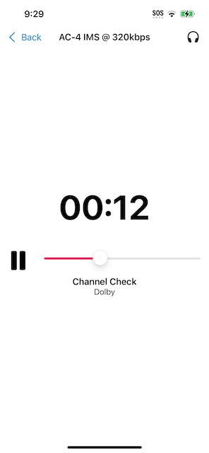

# DAAPlay

An example iOS music/video player integration of Dolby Audio for Applications (DAA) v3.5.7. 

**STOP:** DAAPlay requires the DAA library and API, which are only available to licensees of DAA. See [Dolby Professional](https://professional.dolby.com/licensing/) and [Dolby handbooks](https://handbook.dolby.com/) for information on becoming a licensee.

# Quick Start



From the DAA v3.5.7 SDK:
1. Copy `lib_daa_ac4dec_ios_generic_float32_release.a` to `DAAPlay/Audio/DAA/v3.5.7/lib`
2. Copy `dlb_decode_api.h` to `DAAPlay/Audio/DAA/v3.5.7/include`
3. Copy `dlb_buffer.h` to `DAAPlay/Audio/DAA/v3.5.7/include`

Then open `DAAPlay.xcodeproj`, build, and run

# Features

DAAPlay implements:
* Integration of DAA with AVAudioEngine
* Playback of .ac4 files
* Playback of AC-4 up to Level 3, including AC-4 Immersive Stereo (IMS)
* Playback of AC-4 at a frame rate of 2048 samples/frame (a.k.a. *native* frame rate)
* Latency minimization between DAA and iOS
* Automatic configuration of DAA's endpoint API according to the endpoint detected by iOS
* Trick play (timeline scrubbing)
* Integration of video playback (AVPlayer) with DAA/AVAudioEngine
* A/V sync
* Expert-mode interface
* Content selection menu

DAAPlay does not implement:
* Playback of AC-4 Level 4 A-JOC
* Playback of Dolby Digital Plus (DD+) or DD+JOC
* Playback of AC-4 encoded at video-aligned frame rates
* Playback from .mp4
* Playback from HLS or .m3u8
* Playback from streaming media
* Playback of encrypted content (ex: content protected by Fairplay)
* Headtracked audio
* Sideloading of content


# Tested Devices

* iPhone 13 Pro with iOS 16.4, and AirPods (3rd generation)

# Directories

* `DAAPlay/DAAPlayMain.swift`: main entry point
* `DAAPlay/Views/`: User interfaces (views), written in SwiftUI
* `DAAPlay/Models/`: View models associated with views, written in Swift
* `DAAPlay/Audio/`: Audio player
* `DAAPlay/Audio/AudioPlayerDAA.swift`: AVAudioEngine audio player, based on DAA
* `DAAPlay/Audio/DAA/DAADecoder.[h|m]`: DAA wrapper, written in Objective-C
* `DAAPlay/Audio/DAA/v3.57/[include|lib]`: Add DAA libraries and headers here
* `DAAPlay/Video/`: Video player helpers
* `DAAPlay/Utilities/`: Miscellaneous utility functions
* `DAAPlay/Supporting Files/Media`: Bundled media files
* `DAAPlay/Supporting Files/Media/contentPackingList`: Play list, in .json format

# Architecture


# Developer Guidance

## Enabling MP4 demuxing and HTTP Live Streaming
DAAPlay does not implement MP4 demuxing or HTTP Live Streaming (HLS), however Dolby provides developer resources at: [https://ott.dolby.com](https://ott.dolby.com).

Additionally, source code for a Dolby MP4 demuxer is available on Github: [https://github.com/DolbyLaboratories/dlb_mp4demux](https://github.com/DolbyLaboratories/dlb_mp4demux)  

## Integrating DAA into iOS

Apple offers developers several API options for implementing audio functionality, including `CoreAudio`, `AUGraph`, `AVAudioEngine`, `AVAudioPlayer`, and `AVPlayer`. Each option offers a different trade-off of flexibility, complexity, and abstraction.

DAAPlay integrates DAA with the `AVAudioEngine` API. `AVAudioEngine` is the API with the highest level of abstraction that still has the flexibility needed to integrate DAA.

```swift
// AudioPlayerDAA.swift
class AudioPlayerDAA: AVAudioPlayerNode, ... {
    ...
}
```

```swift
// MusicPlayerViewModel.swift
var player = AudioPlayerDAA()
...
engine.attach(player)
engine.connect(player, to: engine.mainMixerNode, format: format)
...
try engine.start()
```

## Minimizing Output Latency
DAAPlay implements "just-in-time" decoding, operating off a ~5ms timer (256 audio samples @48kHz). This mechanism limits the buffering (i.e. latency) between DAA's output and AVAudioEngine's output mixer to `DAA_AUDIO_BUFFER_SECONDS`.

`schedulingCallback()` estimates the amount of audio buffered (`estimatedBufferedTime`) by observing `AVAudioPlayerNode.playerTime`, and comparing to an internal variable tracking the amount of audio scheduled by the player, `scheduledTime`.

The audio scheduling timer runs in a high priority queue, with a level of `.userInteractive`. This is a deliberate design decision intended to avoid audio dropouts due to high-priority premeptive events (ex: UI animations).

One complication is that the OS can initialize `playerTime.sampleTime` to a negative value, leading to an incorrest estimate of the amount of audio buffered. Experimentation suggests that the initial value is -2 x `AVAudioSession.sharedInstance().ioBufferDuration`. To avoid additional latency, DAA calculates the render time from an epoch that is self-initialized and updated.

Further complications arise when audio devices are connected/disconnected, causing a "jump" in the timeline, or a loss of A/V sync (if there is an associated AVPlayer instance). `schedulingCallback()` handles both of these cases. 

```swift
// AudioPlayerDAA.swift
private let daaDecoderQueue = DispatchQueue(label: Bundle.main.bundleIdentifier! + "daa.decoder.queue", qos: .userInteractive)

...

func openFile(url: URL) throws -> AVAudioFormat? {
  ...
  // A timer schedules decoded audio to at least DAA_AUDIO_BUFFER_SECONDS ahead of buffer exhaustion
  let timer = DispatchSource.makeTimerSource(queue: daaDecoderQueue)
  timer.setEventHandler { [weak self] in
    self?.schedulingCallback()
  }
  timer.schedule(deadline: .now(), repeating: Constants.TWO_FIFTY_SIX_AUDIO_SAMPLES)
  timer.resume()
  ...
}

@objc func schedulingCallback() {
  // Initialize the render time epoch
  if !hasStarted {
    // Experimentation suggests the initial render time is equivalent to 2 x the reported ioBufferDuration
    self.renderTimeEpoch = -2 * AVAudioSession.sharedInstance().ioBufferDuration
  }
  
  if self.state == .playing {
    
    if let nodeTime = self.lastRenderTime, let playerTime = self.playerTime(forNodeTime: nodeTime) {
      let currentRenderTime = TimeInterval(playerTime.sampleTime) / playerTime.sampleRate
      var estimatedBufferedTime = self.scheduledTime - (currentRenderTime - self.renderTimeEpoch)
      
      // When an audio device is connected/disconnected, a higher level player may lose A/V sync
      // if, for example, an AVPlayer pauses while an AVAudioEngine does not. To mitigate,
      // the higher level player may force a re-sync when an audio device is connected or disconnected.
      if forceResync {
        renderTimeEpoch = currentRenderTime - scheduledTime
        forceResync = false
      }
      
      // AVAudioPlayerNode.lastRenderTime can "jump" forward, when a new audio device is connected.
      // Detect these timeline discontinutities, and compensate by adjusting the renderTimeEpoch
      if let priorLastRenderTime = self.priorLastRenderTime {
        if (currentRenderTime - priorLastRenderTime) > (8 * Constants.TWO_FIFTY_SIX_AUDIO_SAMPLES) {
          renderTimeEpoch = currentRenderTime - scheduledTime
          self.priorLastRenderTime = currentRenderTime
          // Don't schedule audio this time
          return
        }
      }
      self.priorLastRenderTime = currentRenderTime
      
      // At start-up, the decoder will consume its own start-up samples, and this loop will
      // iterate multiple times.
      //
      // In normal operation, this loop may operate 0..N times:
      //
      //  - If the callback interval is less than the iOS output buffer size (observed at
      //    480-1024 audio samples, depending upon the connected device), the estimatedBufferedTime
      //    may not change from one callback to the next, as the prior output samples
      //    have not yet been rendered by the iOS (i.e. currentRenderTime may not change
      //    between consecutive calls. In this case, the loop may iterate 0 times.
      //
      //  - When the above occurs, and when the prior output samples are finally rendered
      //    by iOS, the loop may iterate N times to catch up.
      while estimatedBufferedTime < Constants.DAA_AUDIO_BUFFER_SECONDS {
        do {
          let didSchedule = try self.scheduleNextAudio()
          if didSchedule == false { break }
        } catch {}
        estimatedBufferedTime = self.scheduledTime - (currentRenderTime - self.renderTimeEpoch)
      }
    }
  }
}
```

As a further measure to reduce output latency, DAAPlay requests the OS to reduce I/O buffers to 5ms.

```swift
// MusicPlayerViewModel.swift
// VideoPlayerViewModel.swift

private func configureEngine(with format: AVAudioFormat) {
  ...
  engine.prepare()

  // Minimize latency due to OS's IO buffer
  let session = AVAudioSession.sharedInstance()
  do {
    try session.setPreferredIOBufferDuration(Constants.FIVE_MILLISECONDS)
  } catch {
    log.warning("Failed call to setPreferredIOBufferDuration()")
  }
  
  ...

  do {
    try engine.start()
    isPlayerReady = true
  } catch {
    print("Error configuring engine: \(error.localizedDescription)")
  }
}
```


## Integrating Video Playback with DAA
DAAPlay utilizes `AVPlayer` for video playback and `AVAudioEngine` for audio. These players are independent, but jointly managed by the `VideoPlayerViewModel`. Note that the AVPlayer is muted.

A complication is that `AVAudioEngine` output is subject to a latency that is unaccounted for by `AVPlayer`, resulting in a loss of A/V sync. To mitigate this, DAAPlay offsets audio and video play/pause operations by `audioOutputLatency`.

```swift
// VideoPlayerViewModel.swift
var videoPlayer: AVPlayer?
var audioPlayer = AudioPlayerDAA()
private let engine = AVAudioEngine()
private var audioOutputLatency: TimeInterval = 0

...

private func setupVideo(url: URL) {
  videoPlayer = AVPlayer(url: url)
  videoPlayer?.isMuted = true
}

...

func play() {
  self.audioOutputLatency = self.engine.mainMixerNode.outputPresentationLatency
  let isStartOfStream = audioPlayer.playAndDetectStartOfStream()
  if isStartOfStream {
    seekVideo(to: 0) { _ in
      DispatchQueue.main.asyncAfter(deadline: .now() + self.audioOutputLatency) {
        self.videoPlayer?.play()
      }
    }
  } else {
    DispatchQueue.main.asyncAfter(deadline: .now() + self.audioOutputLatency) {
      self.videoPlayer?.play()
    }
  }
}

func pause() {
  audioPlayer.pause()
  DispatchQueue.main.asyncAfter(deadline: .now() + self.audioOutputLatency) {
    self.videoPlayer?.pause()
  }
}
```

## Synchronizing Audio and Video (A/V Sync)
To achieve A/V sync, DAAPlay minimizes output latency, performs just-in-time decoding, offsets play/pause operations between `AVPlayer` and `AVAudioEngine`, and corrects for loss of sync when audio devices are connected or disonnected. These are described above.

To further ensure A/V sync, DAA also implements the following: 
1. Zeroing of DAA algorithmic latency
2. Precise AVPlayer seeking operations
3. Interrupting scheduling when seeking

### Zeroing of DAA Algorithmic Latency
`DAADecoder` zeros (i.e. removes, consumes) its own algorithmic latency (3168 samples, for AC-4 inputs at native frame rate). Hence the zero point on the audio timeline corresponds to the first sample associated with an AC-4 frame. The benefit is that the timeline of an associated AVPlayer does need adjustment to compensate for DAA latency.

```swift
// DAADecoder.m
createDecoderFor() {
  ...
  _startUpSamples = ESTIMATED_LATENCY;
}

decode()
  ...
  /* Decode */
  err = dlb_decode_process(_decoder, &ioParams);
  ...
  
  // Consume "start-up samples"
  if (_startUpSamples > 0) {
    long long samplesToCopy = ioParams.output_samples_num - _startUpSamples;

    if (samplesToCopy <= 0) {
        // Empty frame: Consume all the samples and output a zero frame
        ...
    } else {
        // Partial frame: Consume the first _startUpSamples samples and output the rest
        ...
    }
        
  } else {
    // Output a regular frame (2048 samples)
    ...
  }
}
``` 

### Precise AVPlayer Seeking Operations
`VideoPlayerViewModel.seekVideo()` implements precise seeking, so that AVPlayer remains in sync with AVAudioEngine 

```swift
// VideoPlayerViewModel.swift
private func seekVideo(to newTime: Float64, completionHandler: @escaping (Bool) -> Void) {
  let newCMTime = CMTimeMakeWithSeconds(
    newTime,
    preferredTimescale: CMTimeScale(NSEC_PER_SEC))
  videoPlayer?.seek(
    to: newCMTime,
    toleranceBefore: CMTime.zero,
    toleranceAfter: CMTime.zero,
    completionHandler: completionHandler)
  }
```

### Interrupting Scheduling When Seeking
When seeking, DAAPlay overwrites un-rendered audio in AVAudioEngine's output buffer (i.e. audio from the old playback point), with new audio. The AVAudioEngine APIs refer to this as "interrupting". This approach prevents loss of A/V sync when seeking due to un-rendered audio in AVAudioEngine output buffer.
```swift
// AudioPlayerDAA.swift
func seek(frame: Int) -> Double {
  ...
  // Any playing buffer should be interrupted upon restart
  interruptPlayingBuffer = true
}

func scheduleNextAudio() throws {
  ...
  // If interrupting, the next buffer should overwrite un-rendered audio in AVAudioEngine's output buffer
  var options: AVAudioPlayerNodeBufferOptions = []
  if interruptPlayingBuffer {
    options.insert(.interrupts)
    interruptPlayingBuffer = false
  }
  
  ...
  
  // Schedule buffer
  scheduleBuffer(..., options: options)
}
```

## Configuring Loudness
DAAPlay configures the Output Reference Loudness (ORL) to -16 LKFS.

```
// DAADecoder.m
/* Reset all decoder parameters */

...

parameterValue = -16;
dlb_decode_setparam(_decoder, DLB_DECODE_CTL_OUTPUT_REFERENCE_LEVEL_ID, &parameterValue, sizeof(parameterValue));
```


## Configuring DAA for the Connected Audio Device
DAAPlay's `AudioDeviceManager` detects the currently connected audio device.

```swift
class AudioDeviceManager: NSObject, ObservableObject {
  static let shared = AudioDeviceManager()
  @Published var headphonesConnected = false
  @Published var outputName: String = ""
  @Published var outputType: AVAudioSession.Port = .builtInSpeaker
  @Published var isSpatialAudioEnabled: Bool = false

  ...

  @objc func handleRouteChange(notification: Notification) {
    ...

    switch reason {

    case .newDeviceAvailable: // New device found.
      let session = AVAudioSession.sharedInstance()
      headphonesConnected = hasHeadphones(in: session.currentRoute)

    case .oldDeviceUnavailable: // Old device removed.
      let session = AVAudioSession.sharedInstance()
      headphonesConnected = hasHeadphones(in: session.currentRoute)

    default: ()
    }
    updateActivePort()
  }
  
  ...

  func updateActivePort() {
    let session = AVAudioSession.sharedInstance()
    let route: AVAudioSessionRouteDescription = session.currentRoute
    outputName = route.outputs[0].portName
    outputType = route.outputs[0].portType
    isSpatialAudioEnabled = route.outputs[0].isSpatialAudioEnabled
    
    // Check for un-supported audio endpoints
    if !(hasHeadphones(in: route) || hasBuiltInSpeakers(in: route)) || !isStereo(in: route) {
      // Playing virtualized content over audio endpoints other than stereo headphones
      // and built-in stereo speakers is incorrect.
      //
      // A fully-featured media player is expected to switch to a non-virtualized audio
      // stream when such audio endpoints are connected.
      //
      // However, as DAAPlay does not support more than one audio stream, this app
      // prints an error message and continues.
      self.log.error("Unsupported audio port: \(self.outputName)")
    }
  }

}
```

When a new device is connected, the Video and Music players dynamically configure DAA's `endpoint` according to the connected audio device.

```swift
// MusicPlayerViewModel.swift

// Respond to headphone connect/disconnects
audioDeviceManager
  .$headphonesConnected
  .sink(receiveValue: { headphonesConnected in
    _ = self.player.pauseAndResync()
    self.audioPlayer.setEndpoint(endp: headphonesConnected ? .headphones : .speakers)
  })
  .store(in: &cancellables)
```

```swift
// VideoPlayerViewModel.swift

// Respond to headphone connect/disconnects
audioDeviceManager
  .$headphonesConnected
  .sink(receiveValue: { headphonesConnected in
    self.pauseAndRealignVideoToAudio()
    self.audioPlayer.setEndpoint(endp: headphonesConnected ? .headphones : .speakers)
  })
  .store(in: &cancellables)
```

```swift
// AudioPlayerDAA.swift

func setEndpoint(endp: Endpoint) {
  endpoint = endp
  self.decoder.setHeadphoneEndpoint(endpoint == .headphones)
}
```

# Version History

## Version 1.0
* The initial release of DAAPlay targeting DAA v3.5.7 and playback of AC-4 IMS
